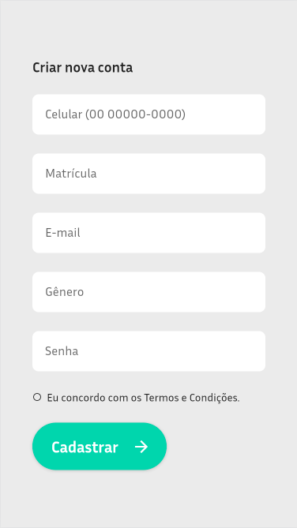

# VemJunto
O aplicativo VemJunto propõe uma solução para o deslocamento de estudantes até a faculdade através de caronas, promovento a integração entre alunos, economia financeira e utilização da tecnologia. Ele permite tanto solicitar uma carona a partir do endereço de partida e chegada fornecida pelo usuário, como oferecer uma carona, detalhando a quantidade de assentos disponíveis. Algumas das funcionalidades desenvolvidas:
- Cadastro de usuários
- Solicitar/Oferecer carona: configurar endereços de partida e destino, quantidade de assentos disponíveis, horário e raio de quilometragem máxima de busca
- Cadastro e exclusão de veículos
- Alteração de perfil do usuário
- Listagem do histórico de caronas

## Linguagens e recursos
- Linguagem: [Dart](https://dart.dev/)
- Framework: [Flutter](https://flutter.dev/)
- Backend: [Firebase](https://firebase.google.com/?hl=pt-br)

## Pré-requisitos e execução
É necessário para o projeto: Flutter SDK 3.7.9, Dart SDK 2.19.6, editor de código, emulador Android ou iOS.

**Passo 1:**
Clone ou baixe o repositório usando o link abaixo:
```
https://github.com/maisamrr/caronasIESB.git
```

**Passo 2:**
Na pasta root do projeto, executar o comando abaixo no console para obter as dependências necessárias:
```
flutter pub get 
```

**Passo 3:**
O projeto deve ser executado usando Run na main.dart do editor de código ou usando o comando abaixo no console.
```
flutter run
```

### Bibliotecas
* [MobX](https://github.com/mobxjs/mobx.dart)

## User Interface
### Login, cadastro e recuperação de senha
       

### Home, Solicitar carona, Oferecer Carona

### Cadastro de veículos
### Atividade e Perfil do usuário

Projeto desenvolvido para as disciplinas de Programação para Dispositivos Móveis e Projeto Integrador 3A em 2023.1 - Ciência da Computação - IESB/Sul.